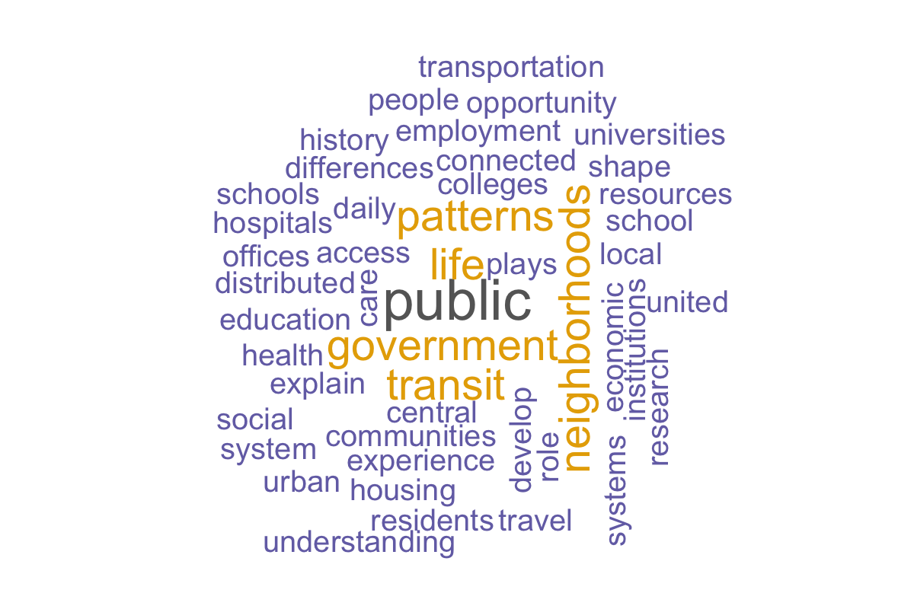

```{r setup, include=FALSE}
knitr::opts_chunk$set(echo = FALSE, warning = FALSE, message = FALSE)

library(tidyverse)
library(readxl)
library(sf)
library(ggplot2)
library(tidytext)
library(igraph)
library(ggraph)
library(wordcloud)
```

```{r}
contri <- read_excel("../data/BostonContrib.xlsx")
zip_map <- st_read("../data/zip_codes.json", quiet = TRUE)

contri2 <- contri %>%
  mutate(
    Zip = as.character(Zip),
    Zip5 = stringr::str_sub(Zip, 1, 5)
  )

zip_map2 <- zip_map %>%
  mutate(ZIP5 = as.character(ZIP5))

map_data <- contri2 %>%
  filter(`Tender Type Description` %in% c("Credit Card", "Check")) %>%
  group_by(Zip5, `Tender Type Description`) %>%
  summarise(
    total_amount = sum(Amount, na.rm = TRUE),
    .groups = "drop"
  )

zip_joined2 <- zip_map2 %>%
  left_join(map_data, by = c("ZIP5" = "Zip5")) %>%
  filter(!is.na(`Tender Type Description`))
```


```{r}
ggplot(zip_joined2) +
  geom_sf(aes(fill = total_amount), color = "white", linewidth = 0.25) +
  facet_wrap(~`Tender Type Description`, ncol = 2) +
  scale_fill_viridis_c(
    option = "C",
    direction = -1,
    na.value = "grey90"
  ) +
  scale_x_continuous(
    breaks = c(-71.20, -71.10, -71.00),
    labels = c("71.20°W", "71.10°W", "71.00°W")
  ) +
  scale_y_continuous(
    breaks = c(42.25, 42.30, 42.35, 42.40),
    labels = c("42.25°N", "42.30°N", "42.35°N", "42.40°N")
  ) +
  labs(
    title = "Boston campaign contributions by ZIP code",
    subtitle = "Comparison of Check and Credit Card contributions",
    fill = "Total amount"
  ) +
  theme_minimal() +
  theme(
    plot.title = element_text(face = "bold", size = 18),
    plot.subtitle = element_text(size = 12),
    strip.text = element_text(face = "bold", size = 13),
    axis.text.x = element_text(angle = 45, hjust = 1, size = 9),
    axis.text.y = element_text(size = 9),
    axis.title = element_blank(),
    panel.grid.major = element_line(color = "grey85", linewidth = 0.3),
    panel.grid.minor = element_blank(),
    legend.title = element_text(size = 11),
    legend.text = element_text(size = 10)
  )
```

## Row

### Part 2: Bigram graph

```{r text-data, include=FALSE}
text_lines <- readLines("text_source.txt", warn = FALSE)

text_df <- tibble(text = text_lines)

custom_stop <- tibble(
  word = c("boston", "city", "cities", "massachusetts", "u.s", "us", "pdf")
)

bigrams <- text_df %>%
  unnest_tokens(bigram, text, token = "ngrams", n = 2)

bigram_counts <- bigrams %>%
  separate(bigram, into = c("word1", "word2"), sep = " ") %>%
  filter(!word1 %in% stop_words$word,
         !word2 %in% stop_words$word,
         !word1 %in% custom_stop$word,
         !word2 %in% custom_stop$word) %>%
  count(word1, word2, sort = TRUE)

word_counts <- text_df %>%
  unnest_tokens(word, text) %>%
  filter(!word %in% stop_words$word,
         !word %in% custom_stop$word) %>%
  count(word, sort = TRUE)
```


```{r}
bigram_counts %>%
  filter(n >= 1) %>%
  graph_from_data_frame() %>%
  ggraph(layout = "fr") +
  geom_edge_link(aes(width = n), alpha = 0.35, show.legend = FALSE, color = "gray60") +
  geom_node_point(size = 4, color = "steelblue") +
  geom_node_text(aes(label = name), repel = TRUE, size = 4) +
  labs(
    title = "Bigram network from text file",
    subtitle = "Connections between common word pairs"
  ) +
  theme_void() +
  theme(
    plot.title = element_text(face = "bold", size = 16),
    plot.subtitle = element_text(size = 11)
  )
```

### Part 2: Word cloud

```{r}
png("wordcloud_hw5.png", width = 1200, height = 800, res = 150)

par(mar = c(1, 1, 1, 1))
set.seed(123)

wordcloud(
  words = word_counts$word,
  freq = word_counts$n,
  min.freq = 1,
  max.words = 80,
  random.order = FALSE,
  rot.per = 0.15,
  scale = c(3, 0.9),
  colors = RColorBrewer::brewer.pal(8, "Dark2")
)

invisible(dev.off())


```


